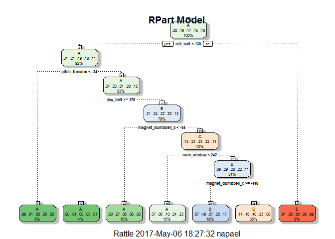
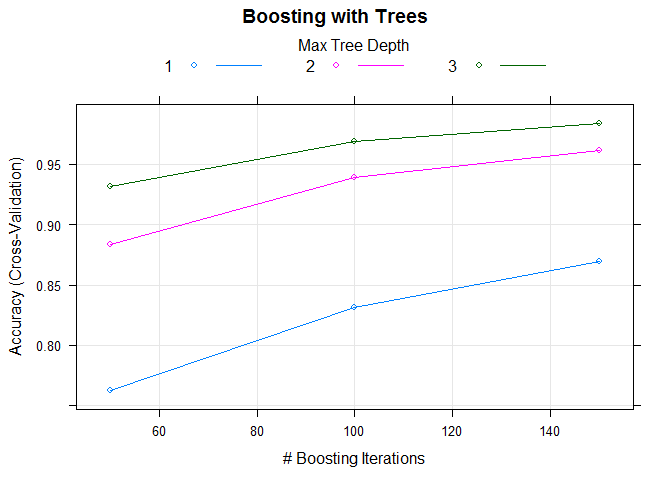
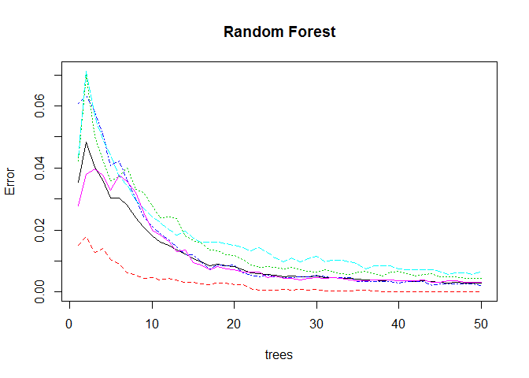

Overivew
--------

For our project we will use data recorded using personal performance devices, such as Jawbone Up, Nike FuelBand, and Fitbit. Our is to build a model in order to predict the manner in which testers did the exercise. We will evaluate training data set, identify predictors, train and evaluate the model performance and accuracy.

Prepare Data
------------

We will partition initial 'training' set into 'training' and 'validation/testing' set for initial model configuration. We will use provided 'testing' set for final testing.

``` r
set.seed(20482)
testing<-read.csv("pml-testing.csv", na.strings = c("NA", ""))
training<-read.csv("pml-training.csv", na.strings = c("NA", ""))
dim(training)
```

    ## [1] 19622   160

### Step 1

Remove desciptive columns & timestamps

``` r
pml<-training
exclude_cols<-which(colnames(training) %in% c("X","user_name","raw_timestamp_part_1","raw_timestamp_part_2","cvtd_timestamp","new_window"))
pml<-pml[, -exclude_cols]
```

### Step 2

We want to identify and remove variants with zero variance

``` r
nzv<-nearZeroVar(pml)
pml<-pml[, -nzv]
```

### Step 3

Remove columns with NA columns &gt; 0.9% and blank strings

``` r
na_cols<-{}
for (c in 1:length(pml)){
  pctNA <- sum(is.na(pml[,c]))/nrow(pml)
  if (pctNA > 0.9) na_cols<-append(na_cols, c)
  if ( any(pml[, c] == "", na.rm=TRUE) ) na_cols<-append(na_cols,c)
}
pml<-pml[,-na_cols]
dim(pml)
```

    ## [1] 19622    54

We effectively reduced number of predictors from 160 to 54

Partition data
--------------

Partition data into actual training & testing sets

``` r
inTrain <- createDataPartition(y=pml$classe,p=0.7, list=FALSE)
myTrain <- pml[inTrain,]
myTest <- pml[-inTrain,]
```

Cross-Validation in train control
---------------------------------

We will use 'cv' parameter for cross validation in trainControl variable in our training models. We are using lower than default number=3 of subsamples to reduce performance impact

``` r
trainControl <- trainControl(method="cv", number=3, verboseIter=F)
```

Model Selection
---------------

### Training

To start, We want to evaluate accuracy of 3 models: CART (rpart), Boosting (gbm), and Random Forests (rf) and assess their accuracy. As a reference, we will also time training for each model: performance may be a consideration when selecting a model.

    ## Loading required package: randomForest

    ## Warning: package 'randomForest' was built under R version 3.2.5

    ## randomForest 4.6-12

    ## Type rfNews() to see new features/changes/bug fixes.

    ## 
    ## Attaching package: 'randomForest'

    ## The following object is masked from 'package:ggplot2':
    ## 
    ##     margin

### Prediction

We will create prediction using test data.

``` r
pred_rpart <-predict(modelFit_rpart, newdata = myTest)
pred_gbm<-predict(modelFit_gbm, newdata=myTest)
pred_rf<-predict(modelFit_rf,newdata=myTest)
```

### Accuracy Test

We will use 'confusionMatrix' function to evaluate our model accuracy.

``` r
cm_rpart<-confusionMatrix(pred_rpart, myTest$classe)
cm_gbm<-confusionMatrix(pred_gbm, myTest$classe)
cm_rf<-confusionMatrix(pred_rf, myTest$classe)
```

Results and Assesment
---------------------

``` r
comp_results<-data.frame(model=c("CART", "GBM", "RF"), 
                         accuracy=c(cm_rpart$overall[1], cm_gbm$overall[1], cm_rf$overall[1]),
                         elapsed=c(tm_rpart[3], tm_gbm[3], tm_rf[3])
)
comp_results<-mutate(comp_results, oos.err=1-accuracy)
comp_results
```

    ##   model  accuracy elapsed     oos.err
    ## 1  CART 0.5417162    8.20 0.458283772
    ## 2   GBM 0.9881054  186.05 0.011894647
    ## 3    RF 0.9986406   43.64 0.001359388

Conclusion
----------

We observe that both rf and gbm models exhibit high degree of accuracy and low out-of-sample error. RF model accuracy is slightly better, and performance is significantly better. There is always a chance that our model is overfitting the training data, and we may consider model ensemble in order to reduce effect of overfitting.

Appendix A
----------

Additional model information and plots

### Rpart Model

``` r
print(modelFit_rpart$finalModel)
```

    ## n= 13737 
    ## 
    ## node), split, n, loss, yval, (yprob)
    ##       * denotes terminal node
    ## 
    ##  1) root 13737 9831 A (0.28 0.19 0.17 0.16 0.18)  
    ##    2) roll_belt< 130.5 12577 8682 A (0.31 0.21 0.19 0.18 0.11)  
    ##      4) pitch_forearm< -33.95 1131    7 A (0.99 0.0062 0 0 0) *
    ##      5) pitch_forearm>=-33.95 11446 8675 A (0.24 0.23 0.21 0.2 0.12)  
    ##       10) yaw_belt>=169.5 554   54 A (0.9 0.04 0 0.051 0.0072) *
    ##       11) yaw_belt< 169.5 10892 8263 B (0.21 0.24 0.22 0.2 0.13)  
    ##         22) magnet_dumbbell_z< -93.5 1319  526 A (0.6 0.27 0.049 0.056 0.026) *
    ##         23) magnet_dumbbell_z>=-93.5 9573 7241 C (0.15 0.24 0.24 0.22 0.14)  
    ##           46) num_window< 241.5 2105 1322 A (0.37 0.058 0.098 0.24 0.23) *
    ##           47) num_window>=241.5 7468 5316 B (0.093 0.29 0.28 0.22 0.11)  
    ##             94) magnet_dumbbell_x>=-447.5 2614 1341 B (0.066 0.49 0.071 0.2 0.17) *
    ##             95) magnet_dumbbell_x< -447.5 4854 2913 C (0.11 0.18 0.4 0.23 0.082) *
    ##    3) roll_belt>=130.5 1160   11 E (0.0095 0 0 0 0.99) *

``` r
rattle::fancyRpartPlot(modelFit_rpart$finalModel, main="RPart Model")
```



### Boosting with Trees Model (GBM)

``` r
print(modelFit_gbm)
```

    ## Stochastic Gradient Boosting 
    ## 
    ## 13737 samples
    ##    53 predictor
    ##     5 classes: 'A', 'B', 'C', 'D', 'E' 
    ## 
    ## No pre-processing
    ## Resampling: Cross-Validated (3 fold) 
    ## Summary of sample sizes: 9158, 9157, 9159 
    ## Resampling results across tuning parameters:
    ## 
    ##   interaction.depth  n.trees  Accuracy   Kappa    
    ##   1                   50      0.7625388  0.6988595
    ##   1                  100      0.8312584  0.7864467
    ##   1                  150      0.8696224  0.8350185
    ##   2                   50      0.8833079  0.8522819
    ##   2                  100      0.9389969  0.9227849
    ##   2                  150      0.9614911  0.9512723
    ##   3                   50      0.9314260  0.9131858
    ##   3                  100      0.9689888  0.9607601
    ##   3                  150      0.9841305  0.9799238
    ## 
    ## Tuning parameter 'shrinkage' was held constant at a value of 0.1
    ## 
    ## Tuning parameter 'n.minobsinnode' was held constant at a value of 10
    ## Accuracy was used to select the optimal model using  the largest value.
    ## The final values used for the model were n.trees = 150,
    ##  interaction.depth = 3, shrinkage = 0.1 and n.minobsinnode = 10.

``` r
plot(modelFit_gbm, main="Boosting with Trees")
```



### Random Forest Model

``` r
print(modelFit_rf$finalModel)
```

    ## 
    ## Call:
    ##  randomForest(x = x, y = y, ntree = 50, mtry = param$mtry) 
    ##                Type of random forest: classification
    ##                      Number of trees: 50
    ## No. of variables tried at each split: 27
    ## 
    ##         OOB estimate of  error rate: 0.29%
    ## Confusion matrix:
    ##      A    B    C    D    E class.error
    ## A 3906    0    0    0    0 0.000000000
    ## B    8 2646    4    0    0 0.004514673
    ## C    0    4 2391    1    0 0.002086811
    ## D    0    0   14 2237    1 0.006660746
    ## E    0    1    0    7 2517 0.003168317

``` r
plot(modelFit_rf$finalModel, main="Random Forest")
```



Appendix B
----------

We will now get apply our model on the test data.

``` r
pred_final_test<-predict(modelFit_rf, newdata = testing)
pred_final_test
```

    ##  [1] B A B A A E D B A A B C B A E E A B B B
    ## Levels: A B C D E
